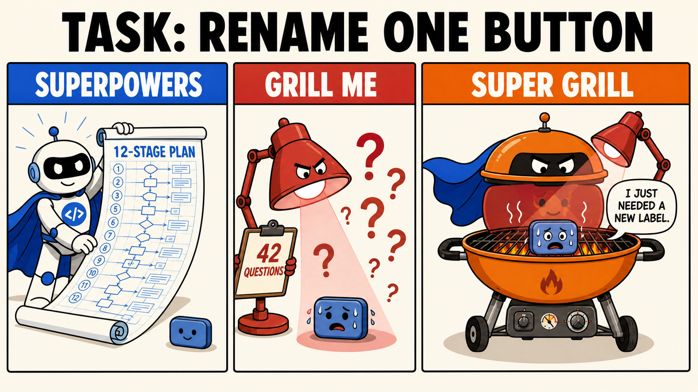

# Super Grill

Super Grill combines Superpowers and Grill Me into one advanced skill—a
complete development workflow that questions every decision from idea to
completion.

Your agent wants to write code after asking two clarifying questions. Super
Grill treats this as a control failure.



## Quickstart

Install the skill:

```bash
npx skills@latest add Hyzenciaga/super-grill
```

Then give your agent a request:

```text
Use $super-grill in well-done mode to plan this one-line button rename.
```

The default heat is `well-done`. If the process reaches a safe internal
temperature before you do, say:

```text
take it off the grill
```

That exact phrase stops further questioning and produces a final handoff.

## How It Works

Most coding workflows move through discovery, design, planning,
implementation, and review once.

Super Grill moves through those stages, questions every decision, writes down
the answers, questions the written answers, implements the approved answers,
and then checks whether implementation has changed the meaning of the original
questions.

The workflow maintains a **Grill Ledger** containing:

- settled decisions;
- rejected alternatives;
- load-bearing assumptions;
- open decision branches;
- gathered evidence;
- generated artifacts;
- unlocked achievements; and
- the current location of the food.

Facts are gathered from the environment. Decisions stay with the user.
Questions arrive one at a time with a recommended answer. No artifact advances
until the active heat level's gates have passed.

This produces a uniquely high ceremony-to-output ratio while remaining just
coherent enough to finish.

## Installation

Super Grill is a plain [Agent Skill](https://agentskills.io/). It does not
require Superpowers, Grill Me, a runtime service, an API key, or actual cooking
equipment.

### Codex and other agents — recommended

Run one command:

```bash
npx skills@latest add Hyzenciaga/super-grill
```

Choose Codex, Claude Code, Cursor, Gemini CLI, or any other detected Agent
Skills-compatible client when prompted. The installer handles the destination;
no manual cloning or directory surgery is required.

For a global, non-interactive installation:

```bash
npx skills@latest add Hyzenciaga/super-grill -g -y
```

### Claude Code native plugin — optional

Claude Code can use the universal command above. If you prefer its native
managed-plugin flow, run:

```text
/plugin marketplace add Hyzenciaga/super-grill
/plugin install super-grill@super-grill
```

The repository contains validated Claude Code plugin and marketplace manifests,
so no hand-written local configuration is needed.

### Updating

Skills CLI:

```bash
npx skills update super-grill
```

Claude Code native plugin:

```text
/plugin update super-grill@super-grill
```

Restart the agent or begin a new session if it does not discover the new
thermal-governance department immediately.

## Choosing a Heat

| Heat | Recommended when | Process profile |
| --- | --- | --- |
| `medium-rare` | You need rigor but still have plans this afternoon | One full pass through every major gate |
| `well-done` | You want the intended Super Grill experience | Two passes per artifact, including an adversarial pass |
| `charcoal` | The task is dangerously close to being straightforward | Three review personalities, all twelve grilling lenses, and task-level re-grilling |
| `eternal-flame` | You explicitly want process without a natural predator | Charcoal repeats until `take it off the grill` is spoken |

`eternal-flame` is never selected implicitly. No ordinary use of words such as
"thorough", "careful", or "please don't break production" constitutes consent.

## The Basic Workflow

1. **Seat the Party**

   Inspect the repository, documentation, history, tests, constraints, and
   available tools. The request receives a table number and loses the right to
   call itself "just a tiny change."

2. **Menu Inquisition**

   Walk a dependency-aware tree of decisions one skewer at a time—or serve the
   whole ready frontier when the user explicitly orders the buffet.

3. **Flight of Competing Sauces**

   Put two or three real approaches through a fair sauce trial and preserve the
   losing arguments for future archaeological committees.

4. **Architectural Dry Rub**

   Present architecture, boundaries, interfaces, data flow, failure behavior,
   testing, operations, and rollback in separately approved sections.

5. **Recipe Deposition**

   Write the specification, cross-examine it for contradictions, mystery
   ingredients, vocabulary fraud, and runaway catering, then obtain a second
   approval for the written artifact.

6. **Skewer Bureaucracy**

   Break the recipe into tiny vertical slices containing exact files,
   interfaces, test code, commands, expected evidence, and optional authorized
   commits.

7. **Kitchen Quarantine**

   Detect existing isolation, establish a clean workspace, and run a baseline
   before anybody handles a knife.

8. **Sous-Chef Conveyor Belt**

   Give each planned task to a fresh implementer, require Raw–Sizzle–Rest test
   evidence, and forbid the implementer from certifying its own cooking.

9. **Smoke Autopsy**

   Reproduce failures, trace the first bad state, test one hypothesis at a time,
   and convene an Architecture Arson Hearing after three failed fixes.

10. **Health Inspector Carousel**

    Run separate recipe-compliance and texture inspections, route material
    findings through a five-round correction loop, and preserve trivial
    complaints for the executive inspector.

11. **Thermometer Court**

    Put every completion claim on trial against a fresh command, complete
    output, exit status, and the original order.

12. **Closing-Time Tribunal**

    Present the environment-valid branch choices and execute only the
    disposition the user authorizes.

The agent may move backward at any gate. This is not a regression. It is
thermal recirculation.

## Achievement System

Super Grill includes an evidence-based professional recognition framework.
Achievements are recorded in the Grill Ledger and have no monetary value.

Known certifications include:

- **Famous Last Words** — say "this should be easy";
- **Raw in the Middle** — say "ship it" before final verification;
- **Enterprise Tapas** — accumulate more than ten decisions for a one-line
  change;
- **The Answer Is a Rollback Plan** — reach question 42; and
- **Health Inspector Intervention** — use the exit phrase.

Additional achievements are intentionally underdocumented to preserve
organizational discovery.

## What Is Inside

```text
super-grill/
├── .claude-plugin/
│   ├── marketplace.json
│   └── plugin.json
├── SKILL.md
├── agents/
│   └── openai.yaml
└── references/
    ├── easter-eggs.md
    ├── food-safety-theater.md
    ├── grill-levels.md
    ├── kitchen-industrial-complex.md
    ├── menu-inquisition.md
    └── recipe-deposition.md
```

- **[SKILL.md](SKILL.md)** owns the workflow, gates, Grill Ledger, and question
  discipline.
- **[plugin.json](.claude-plugin/plugin.json)** and
  **[marketplace.json](.claude-plugin/marketplace.json)** provide the native
  Claude Code installation path.
- **[grill-levels.md](references/grill-levels.md)** defines the four heat
  levels, analytical lenses, and ceremonial temperature conversions.
- **[easter-eggs.md](references/easter-eggs.md)** contains phrase triggers,
  question-count achievements, and rare operational incidents.
- **[menu-inquisition.md](references/menu-inquisition.md)** defines decision
  trees, frontier service, fact scouts, vocabulary records, and the fog smoker.
- **[recipe-deposition.md](references/recipe-deposition.md)** governs
  sectional design, written specifications, microscopic plans, and their
  cross-examinations.
- **[kitchen-industrial-complex.md](references/kitchen-industrial-complex.md)**
  provides workspace isolation, sub-agent job titles, independent inspections,
  parallel scouts, and the five-alarm fix loop.
- **[food-safety-theater.md](references/food-safety-theater.md)** contains the
  Raw–Sizzle–Rest law, smoke autopsy, review handling, verification court, and
  branch tribunal.
- **[openai.yaml](agents/openai.yaml)** provides Codex and Agent Skills UI
  metadata.

## Philosophy

- **Ceremony over throughput** — velocity is an unreviewed assumption.
- **Questions before answers** — and, where appropriate, questions after
  answers.
- **One decision per turn by default** — unless the diner explicitly orders
  bewilderment by the platter.
- **Evidence over confidence** — "looks cooked" is not a verification command.
- **Reversibility over optimism** — every grill needs an off switch.
- **Process over simplicity** — a simple task is merely a complex task that has
  not completed intake.

## Operational Guidance

Super Grill is parody software that follows its process with a straight face.
It is best used for recreational overthinking, requirements workshops,
low-stakes planning, demonstrations of agent workflows, and any one-line
change that has escaped adequate governance.

It is not recommended during active production incidents, emergency hotfixes,
fire alarms, medical procedures, or situations where somebody is waiting for
you to select a pizza topping.

The workflow must not fabricate risks or repeat identical questions merely to
consume time. When no new information is available, it records the majestic
absence of change and proceeds to the next required lens.

## Influences

Super Grill is an original orchestration skill inspired by:

- [obra/superpowers](https://github.com/obra/superpowers), a complete,
  stage-gated development methodology for coding agents; and
- [mattpocock/skills](https://github.com/mattpocock/skills), particularly its
  decision-tree interview, frontier rounds, written vocabulary and decision
  records, and breadth-first mapping experiments.

Both upstream projects are MIT-licensed. Super Grill does not invoke them as
competing routers and does not require them at runtime.

## Contributing

Contributions are welcome.

Before proposing a simplification, please document:

1. which committee approved it;
2. whether the simplification has passed all four heat levels;
3. the rollback plan if users understand the workflow too quickly; and
4. why the same result cannot be achieved with three additional questions.

Practical bug fixes may skip item four with written authorization from the
Head of Marinade.

## License

MIT. See [LICENSE](LICENSE).
